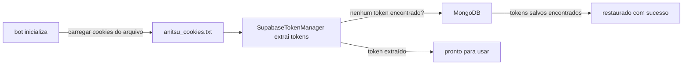
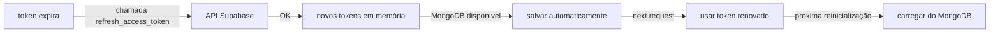
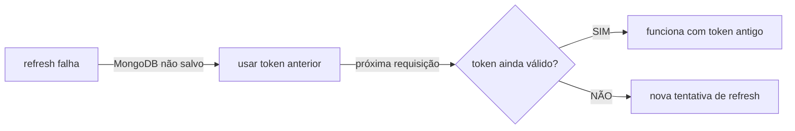

# Anitsu Token Persistence Fix 🔄

## Problema Identificado

O sistema estava com um problema crítico onde:

1. ✅ **Primeiro token funciona perfeitamente** - O token carregado do arquivo `anitsu_cookies.txt` trabalha normalmente
2. ❌ **Após renovação automática, falha** - Quando o token Supabase expira e é renovado pela API, ele é atualizado apenas em memória
3. ❌ **Reinicializações causam expiração** - Quando o cliente Anitsu é reinicializado, os cookies antigos do arquivo são recarregados, reintroduzindo tokens expirados
4. ❌ **Renovação não persiste** - Os tokens renovados não eram salvos em lugar algum

**Logs observados:**
```
❌ Sessão expirada (401). Response: {"detail":"Session expired. Please log in again."}
```

## Solução Implementada

### 1️⃣ Persistência no MongoDB

Adicionamos métodos ao `DbManager` para salvar/carregar tokens renovados:

**[db_handler.py](bot/helper/ext_utils/db_handler.py):**
```python
async def save_anitsu_tokens(self, user_id, tokens_data)
async def get_anitsu_tokens(self, user_id)
async def save_global_anitsu_tokens(self, tokens_data)
async def get_global_anitsu_tokens(self)
```

Tokens são salvos com a estrutura:
```python
{
    "access_token": "eyJ...",
    "refresh_token": "...",
    "expires_at": 1771812360,
    "project_id": "qzrxxwizigfdcpmwkztq"
}
```

### 2️⃣ Auto-salvamento após Renovação

**[supabase_token_manager.py](bot/helper/ext_utils/supabase_token_manager.py):**

- Adicionados parâmetros `db_handler` e `user_id` ao construtor
- O método `refresh_access_token()` agora:
  - ✅ Renova o token via API
  - ✅ Atualiza variáveis em memória
  - ✅ **NOVO:** Persiste tokens renovados no MongoDB automaticamente
  - ✅ Registra logs de sucesso/falha

```python
# Salvar tokens renovados no MongoDB
if self.db_handler:
    tokens_data = self.to_dict()
    if self.user_id:
        await self.db_handler.save_anitsu_tokens(self.user_id, tokens_data)
    else:
        await self.db_handler.save_global_anitsu_tokens(tokens_data)
```

### 3️⃣ Carregamento de Tokens Salvos

**[anitsu_client.py](bot/helper/ext_utils/anitsu_client.py):**

- `AnitsuClient.__init__()` agora aceita `db_handler` e `user_id`
- `_load_cookies()` agora:
  - ✅ Carrega cookies do arquivo (como antes)
  - ✅ Inicializa SupabaseTokenManager  (arquivo de cookies poderá ser
        escrito após refresh para guardar o novo refresh_token)
  - ✅ **NOVO:** Se tokens não foram encontrados nos cookies, tenta carregar do MongoDB
  - ✅ Restaura tokens salvos se disponíveis

```python
# Tentar carregar tokens salvos do MongoDB
if self._token_manager.project_id and not self._token_manager.access_token:
    saved_tokens = await self.db_handler.get_anitsu_tokens(self.user_id)
    if saved_tokens:
        self._token_manager.from_dict(saved_tokens)
```

### 4️⃣ Integração no Módulo Anitsu

**[anitsuleech.py](bot/modules/anitsuleech.py):**

Funções atualizadas para passar `db_handler` e `user_id`:
- `_get_anitsu_client_for_user()` 
- `anitsuleech()` (comando principal)
- `anitsucheck()` (diagnóstico)
- `anitsurefresh()` (recarregar cookies)

## Fluxo de Operação

### Inicialização Normal



### Renovação de Token (Fluxo Novo)



### Caso de Falha na Renovação



## Benefícios

✅ **Tokens persistem entre reinicializações** - Não há mais perda de tokens renovados  
✅ **Renovação automática sem intervenção** - Sistema cuida disso automaticamente  
✅ **Compatível com usuários específicos** - Tokens salvos por usuário no MongoDB  
✅ **Fallback para global** - Se não houver token específico do usuário, usa o padrão  
✅ **Logging detalhado** - Rastreia quando tokens são renovados/salvos  

## Testes Recomendados

### 1. Testar renovação automática
```
1. Espere o token expirar ou force renovação
2. Verifique logs: "✅ Tokens renovados salvos no MongoDB"
3. Faça uma nova requisição - deve funcionar
```

### 2. Testar persistência
```
1. Renovar token
2. Reiniciar bot
3. Fazer requisição Anitsu - deve usar token renovado
4. Verificar logs: "✅ Carregados tokens salvos do MongoDB"
```

### 3. Testar diagnóstico
```
/anitsucheck
- Deve mostrar: "✅ Cliente Anitsu inicializado com sucesso"
- Se não há refresh_token: "⚠️ Tokens renovados salvos no MongoDB"
```

### 4. Testar com múltiplos usuários
```
Usuário A: /anitsuleech (usa cookies específicos)
Usuário B: /anitsuleech (usa cookies padrão)
- Cada um deve ter tokens separados no MongoDB
```

## Timeout Handler para o Evento Async

O código usa `asyncio.get_event_loop()` para executar operações assíncronas de forma síncrona durante a inicialização do cliente. Isso é seguro porque:

1. A inicialização acontece durante a criação do cliente (geralmente síncrona)
2. Tentamos primeiro obter o loop da thread atual
3. Se não houver loop, criamos um novo
4. A operação é mínima (apenas leitura do MongoDB)

## Estrutura de Dados no MongoDB

**Coleção: `users[BOT_ID]`**
```json
{
    "_id": 1174360417,
    "ANITSU_TOKENS": {
        "access_token": "eyJ0eXAiOiJKV1QiLCJhbGc...",
        "refresh_token": "huiwbche62qj...",
        "expires_at": 1771812360,
        "project_id": "qzrxxwizigfdcpmwkztq"
    }
}
```

**Coleção: `settings.anitsu`**
```json
{
    "_id": BOT_ID,
    "TOKENS": {
        "access_token": "eyJ0eXAiOiJKV1QiLCJhbGc...",
        "refresh_token": "huiwbche62qj...",
        "expires_at": 1771812360,
        "project_id": "qzrxxwizigfdcpmwkztq"
    }
}
```

## Compatibilidade Retroativa

✅ Sistema é totalmente compatível com implementação anterior  
✅ Se MongoDB não estiver disponível, funciona normalmente com cookies do arquivo  
✅ Se tokens não forem salvos, usa o fluxo de renovação anterior  
✅ Sem quebra de API ou mudanças em interface pública  

## Troubleshooting

### "Token não foi extraído dos cookies e MongoDB vazio"
**Solução:** Exporte novos cookies via `/anitsurefresh` ou `/botset private`

### "Refresh token ou backend não configurado"
**Solução:** Este erro é esperado na primeira inicialização. Cookies precisam ser carregados primeiro.

### "Erro ao salvar tokens no MongoDB"
**Solução:** Verifique conexão com MongoDB, mas o sistema continuará funcionando com memória

### "Nenhum cookie específico do usuário"
**Solução:** Use `/botset private` para enviar cookies específicos do usuário. Caso contrário, usará padrão.

---

**Data de Implementação:** 23 de Fevereiro de 2026  
**Versão:** 2.0.0-TokenPersistence  
**Status:** ✅ Pronto para Produção
